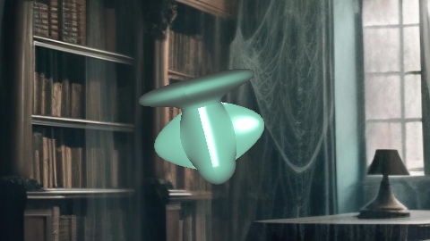
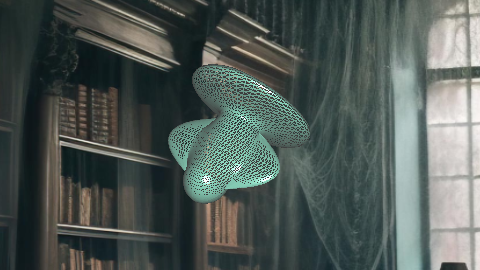
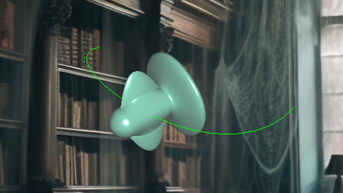

# Haunted Library

<video controls autoplay muted loop width="100%">
  <source src="../assets/videos/intro.mp4" type="video/mp4">
  Your browser does not support the video tag.
</video>

Hello everyone, welcome to my blog. In this blog, I will explain my homework for Computer Graphics 2 class.

In this homework i was expected to implement Bezier surfaces for rendering my ghost, and also this ghost has to follow a curved path which is randomly generated by using Bezier curves with C1 continuity. While following this path, it has a roll motion along its front axis which is implemented using quaternions.

Now, I will explain how I implemented all those things part by part.

## 1. Ghost

In this part, I will explain how I implement my ghost using Bezier curves.

### 1.1 Designing Ghost

For designing my ghost, I have used the given matlab codes for visualizing Bezier curves.

First, I have created my body part and i have built my ghost on this base. I have used 4 surfaces for that part to obtain a perfect cylinder. Then, I part away the surfaces form 2 lines to obtain a interval for designing the arms of my ghost. And there is a gap on top and bottom for head and bottom part

Actually after designing the body I have to use 4 surfaces for every part. This has to be done, in order to obtain C1 continuity between new surfaces. Also, I arrange my control points to obtain C1 continuity. For crossing edges, corresponding control points’ derivatives are always zero for my convenience. However, the difference between these control points’ length are not always equal and for this reason I am only be able to obtain g continuity. Better approach would be c continuity but this is also looking smooth as you will see in other section

### 1.2 Rendering Ghost on OpenGL





For rendering ghost on OpenGL first, I initialized my Bezier surface points. For creating my points, I have used the Bernstein’s polynomial equation. For calculating the normals, first I calculated the derivatives as the difference along ‘t’ and ‘s’. Then I take the cross product of these 2 vectors to have my normal.

The problem is calculating the derivatives as difference between the points will not be smooth when the number of samples are small. Therefore, I calculated my derivative directly from the Bernstein’s polynomial equation to solve these problems. 

When we create our surfaces with smaller sample rates, this might be causing a mismatch between the normals and the actual geometry. Therefore, I calculate my normals as the average of normals of the triangles that are sharing the same vertices. 

```cpp
void Ghost::createBezierPoints(float s, float t, int surfIndex){
    float bernsteinS[4], bernsteinT[4];
    float derBernsteinS[4], derBernsteinT[4];
    float pointX = 0, pointY = 0, pointZ = 0;

    float dsX = 0, dsY = 0, dsZ = 0;
    float dtX = 0, dtY = 0, dtZ = 0;
    float normalX, normalY, normalZ;

    bernsteinS[0] = pow((1-s),3);
    bernsteinS[1] = 3*pow((1-s),2) * (s);
    bernsteinS[2] = 3*(1-s) * pow(s,2);
    bernsteinS[3] = pow(s,3);

    bernsteinT[0] = pow((1-t),3);
    bernsteinT[1] = 3*pow((1-t),2) * (t);
    bernsteinT[2] = 3*(1-t) * pow(t,2);
    bernsteinT[3] = pow(t,3);

    derBernsteinS[0] = -3 * pow((1 - s), 2);
    derBernsteinS[1] = -3 * 2 * (1 - s) * s + 3 * pow((1 - s), 2);
    derBernsteinS[2] = -3 * pow(s, 2) + 3 * (1 - s) * 2 * s;
    derBernsteinS[3] = 3 * pow(s, 2);
    
    derBernsteinT[0] = -3 * pow((1 - t), 2);
    derBernsteinT[1] = -3 * 2 * (1 - t) * t + 3 * pow((1 - t), 2);
    derBernsteinT[2] = -3 * pow(t, 2) + 3 * (1 - t) * 2 * t;
    derBernsteinT[3] = 3 * pow(t, 2);    


    for (int i = 0; i < 4; ++i) {
        for (int j = 0; j < 4; ++j) {
            pointX += bernsteinS[i] * bernsteinT[j] * CP[surfIndex][i][j].x;
            pointY += bernsteinS[i] * bernsteinT[j] * CP[surfIndex][i][j].y;
            pointZ += bernsteinS[i] * bernsteinT[j] * CP[surfIndex][i][j].z;

            dsX += derBernsteinS[i] * bernsteinT[j] * CP[surfIndex][i][j].x;
            dsY += derBernsteinS[i] * bernsteinT[j] * CP[surfIndex][i][j].y;
            dsZ += derBernsteinS[i] * bernsteinT[j] * CP[surfIndex][i][j].z;
    
            dtX += bernsteinS[i] * derBernsteinT[j] * CP[surfIndex][i][j].x;
            dtY += bernsteinS[i] * derBernsteinT[j] * CP[surfIndex][i][j].y;
            dtZ += bernsteinS[i] * derBernsteinT[j] * CP[surfIndex][i][j].z;
        }
    }


    normalX = dsY * dtZ - dsZ * dtY;
    normalY = dsZ * dtX - dsX * dtZ;
    normalZ = dsX * dtY - dsY * dtX;

    float length = sqrt(normalX * normalX + normalY * normalY + normalZ * normalZ);
    if (length > 0.001) { 
        normalX /= length;
        normalY /= length;
        normalZ /= length;
    } else {
        normalX = 0;
        normalY = 0;
        normalZ = 1;
        if (surfIndex < 6) normalY = 1;
        else if (surfIndex < 8) normalY = -1;
        else if (surfIndex < 16) normalZ = 1;
        else if (surfIndex < 20) normalZ = -1;
    }

    vertices.push_back(pointX);
    vertices.push_back(pointY);
    vertices.push_back(pointZ);

    normals.push_back(normalX);
    normals.push_back(normalY);
    normals.push_back(normalZ);
}
```

I couldn’t be able to calculate the average of normals at the crossing edges, so as a result my ghost does not seem smooth at smaller sample rates. However rendering it in higher sample rates make it seem more smooth.

For creating my triangles from my surfaces, we have to use tesselation. For this project, I tesselate the surfaces manually by arranging my indices. For efficiency while drawing my triangles, I have used “GL_TRIANGLE_STRIP”. Therefore, I arrange my indices like this in order to draw my triangles.

Since we are drawing our triangles with “GL_TRIANGLE_STRIP”,
we cannot draw our all triangles with single draw call. We need to call “glDrawElements” for every lines of our surfaces. Here is the code below:

```cpp
void Ghost::draw() {
    glBindVertexArray(VAO);
    for (int i = 1; i < nSamples*nSurf; ++i) {
        glDrawElements(GL_TRIANGLE_STRIP,  nSamples*2, GL_UNSIGNED_INT, (void*)((i-1)*sizeof(int)*nSamples*2));
        //glDrawElements(GL_LINE_STRIP,  nSamples*2, GL_UNSIGNED_INT, (void*)((i-1)*sizeof(int)*nSamples*2));
    }
    glBindVertexArray(0);
}
```

## 2. Randomly Generated Curved Path

In this part, I will explain how I  implement a randomly generated curved path that my ghost follows.
### 2.1 Generating Path with Bezier Curves

For generating my paths, I used Bernstein’s Polynomial equation same as rendering my ghost. I will not go into details because I have already explained, how I calculated my Bezier points and derivatives of the curve. However, I can show the difference between the rendering a path between higher and smaller sample rates. As you can guess the path rendered with the higher sample rate is more smooth than the other one.



### 2.2 Implementation of Ghost to Follow Path Properly

For my ghost to follow this path properly, I need to update my ghost’s local front, up and right vectors according to the path. If I don’t do this my ghosts face will not follow the path and the result won’t seem realistic. To do this, I follow this algorithm:

* Make the front vector of an object equal to the derivative of the curve at the current position
* Calculate the right vector by taking the cross product of the previous up vector and the new front vector
* Calculate the new up vector by taking the cross product of the new front and right vector

Here is the corresponding c++ code of this algorithm:

```cpp
glm::vec3 interpolatedPosition = glm::mix(P0, P1, localT);
glm::vec3 tangent = glm::normalize(glm::mix(tangent0, tangent1, localT));

glm::vec3 front = tangent;
glm::vec3 right   = glm::normalize(glm::cross(prevUp, front));
glm::vec3 up = glm::normalize(glm::cross(front, right));
prevUp = up;  
```

Also instead of doing this calculation glm has a function for calculating this for you which is “glm::lookAt()”. One can use this function instead of manually calculating the vectors.

After doing this another task is that is the ghost should follow the path continuously. If we do not do this, our ghost will teleport along the path. To achieve the continuity, we need to interpolate the position and the rotations every frame. For this purpose I have used “glm::mix” which makes linear interpolation between two vectors.

### 2.3 Generating Random Continuous Curves

After our ghost come to the end of a path new path should be generated and this new path has to be continuous with the previous path. To do this we can use Bezier Curves. There is two restriction to achieve this.

* Last point of the previous curve should be the first point of the new curve (C0 continuity)
* The derivative of the end point of the curve should be equal to the derivative of the initial point of the new curve (C1 continuity)

For Bezier curves instead of taking the derivative of the curves we can calculate the difference between the last 2 control points and generate a new point on that path to get our 2nd control point for our new path. Other 2 control points are randomly generated to achieve the randomness.

```cpp
void generatePath() {
    float boundX = 15.0f;
    float boundY = 8.0f;
    float boundZ = 8.0f;
    std::random_device rDevice;
    std::mt19937 gen(rDevice());
    std::uniform_real_distribution<float> distrX(-boundX, boundX);
    std::uniform_real_distribution<float> distrY(-boundY, boundY);
    std::uniform_real_distribution<float> distrZ(-boundZ, boundZ);

    glm::vec3 CP1 = CP[3];

    glm::vec3 CP2 = ((CP[3]-CP[2])) + CP[3];
    
    float randomX1 = distrX(gen);
    float randomY1 = distrY(gen);
    float randomZ1 = distrZ(gen);

    glm::vec3 CP3 = {randomX1, randomY1, randomZ1};

    float randomX2 = distrX(gen);
    float randomY2 = distrY(gen);
    float randomZ2 = distrZ(gen);

    glm::vec3 CP4 = {randomX2, randomY2, randomZ2};

    CP[0] = CP1;
    CP[1] = CP2;
    CP[2] = CP3;
    CP[3] = CP4;

    path->~Path();
    path = new Path(nSamples, CP);
}
```

## 3. Roll Motion Along the Path

In this part I will explain how I implement the roll motion of my ghost using quaternions.

### 3.1. Implementation of Roll Motion using Quaternions

First, I want to start with a reason behind that why we are using quaternions instead of euler angles. Because we want to avoid the common problem named “Gimbal Lock” problem. Which is a problem in Euler angle rotation where two rotation axes align, causing a loss of one degree of freedom and making smooth, arbitrary rotations impossible. To accomplish smooth roll motion, I used “glm::angleAxis” which creates a quaternion from an angle and axis we want roll along. Here is the given code:

```cpp
glm::mat4 orientation = glm::mat4(1.0f);
orientation[0] = glm::vec4(right, 0.0f); 
orientation[1] = glm::vec4(up, 0.0f); 
orientation[2] = glm::vec4(front, 0.0f); 

static float rollDeg = 0;
static float changeRoll = 2.5;
float rollRad = (float)(rollDeg / 180.f) * M_PI;

if (!pauseFlag) {
    rollDeg += changeRoll;
    if (rollDeg >= 30.f || rollDeg <= -30.f)
    {
        changeRoll *= -1.f;
    }
}
glm::quat rollQuat  = glm::angleAxis(rollRad,  front); 

glm::mat4 model = glm::toMat4(rollQuat) * orientation; 

model = glm::translate(glm::mat4(1.0f), interpolatedPosition) * model;

model = glm::rotate(model, glm::radians(90.0f), glm::vec3(0, 1, 0));
model = glm::rotate(model, glm::radians(-90.0f), glm::vec3(1, 0, 0));
model = glm::scale(model, glm::vec3(0.5f));  
```

However, we have to be careful on calculating the modeling matrix here. If we translate the object  before rotation, the object will rotate around the origin instead of its own center. This is not we want because we want the roll motion around its gaze vector. 

## 4.Summary

Finally, we get out little ghost to explore around the this haunted library as we expected. Now, I want to share some of my observations about this project.

As I stated before, our object looks become smoother when we render it with higher sample rates. On the other hand, if we render it with very high sample rate such as 500, rendering will take some time and also fps has decreased significantly, when our program is running in wireframe mode. So, while choosing sample rates we have to consider these both case and find a appropriate sample rate for our program.

That’s all for now! Hopefully I managed to explain how I tackled this homework in a clear and understandable way. It was a fun (and sometimes frustrating) process, but I definitely learned a lot while implementing it. If you’ve got questions or just want to chat about it, feel free to reach out.

Thanks for reading!
